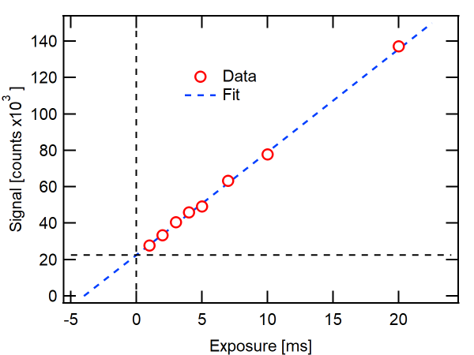

Setting up the beamline
########################

In this section we will outline the authors prefered method for preparing the beamline prior to data collection. We will assume the reader has some familiarity with the instrument itself and basic operating  procedures will not be provided.

Prior to arriving at the beamline
*********************************
Make sure the beamline scientist is aware of your intention to run p-RSoXR. You will want the *Piezo Shutter* connected prior to loading samples. This requires a separate cable hookup that enables a bypass to the pneumatic shutter. For new users, this should be carried out by the staff scientist. The *Piezo shutter* allows for shorter dwell times (down to 1ms) enabling direct images of the beam.

Mounting samples
*****************
The beamline has available a series of sample plates prepared for reflectivity. Samples are typically taped
to the plate using double-sided sticky carbon tape. This ensures the samples will not move during theta-scans and provides sufficient conductivity if the user would like to measure TEY NEXAFS.

.. figure:: SamplePlate.png
	:height: 200px
	:width: 400px
	:align: center
	
	Sample plate ready for measurements.
	
We recommend sample dimensions to be at least 1cm x 1cm to allow enough real-estate to raster the beam across the sample during measurements. This helps to limit exposure on a single spot and reduces beam damage.

.. note::
	Be sure to include a piece of YAG (to locate the beamspot) and something to calibrate the energy (polystyrene or HOPG will work). Both can be provided by the beamline scientist. 
	
	Reflectivity holders are not often utilized and will likely not have any references attached by default.
	
	
Instrument setup
*****************
Once samples have been loaded and the base pressure of the chamber has been achieved we can now setup the beamline for reflectivity.

* These steps can be finished while the camera is being cooled down to -45 C
	#. Move the photodiode into the field of view.
		* Use the *Photodiode Far* motor position
	#. Verify the beam spot using the YAG crystal.
	#. Align JJ slits if not done so by beamline scientist
		* Default reflectivity settings for vertical and horizontal aperture size:
			* ``Upstream JJ Apertures = 0.1`` [mm]
			* ``Middle JJ Apertures = 0.4`` [mm]
			* ``In-Chamber JJ Apertures = 0.8`` [mm]
	#. Measure the intensity of the direct beam
		* Periodically measure the direct beam using the photodiode. Changes in intensity may require adjusting dwell times later on in the run.
	#. Calibrate the photon energy using a reference sample.
		* An energy offset can be applied during the runfile if necessary.
	
.. figure:: I0_Ref.png
	:height: 250px
	:width: 800px
	:align: left
	
	Left: Direct beam measured on the photodiode (PD) normalized to the upstream gold mesh mirror (Ai3). Right: Transmission NEXAFS on polystyrene sample. Energy of pi-pi antibonding resonance is indicated, (~285.1 eV)
	
* Once the CCD has reached -45 C proceed with the following steps to image the direct beam.
	#. Set the ``Higher Order Suppressor = 12`` [deg]
	#. Set the ``Horizontal Exit Slit = 150`` [mm]
	#. Set the ``Beamline Energy = 270.0`` [eV]
	#. Set the ``Exposure = 0.001`` [s]
	#. Move the CCD to *Beamstop Center Far*
		* ``CCD X = 95.5`` [mm]
		* ``CCD Y = 100`` [mm]
		* ``CCD theta = 0`` [deg]
	#. Move the Beamstop to the edge of the camera.
		* ``Beamstop = 2`` [mm]
	#. Set the ``Sample Theta = 0`` [deg]
	#. Move the sample plate *below* the beam
		* ``Sample Z = -5`` or ``Sample Z = 5`` [mm]

.. warning::

	Imaging the direct beam on the CCD can damage the detector. Make sure the flux has been sufficiently suppressed before taking any images.
	
#. Snap a picture to locate the direct beam.
	* *Only continue if the CCD is not saturating*
#. Define an ROI around the beamspot
	#. Open the ``Menu name missing`` menu from the top left corner of the CCD display image
	#. Adjust the ROI dimensions until the beamspot is centered.
	#. Standard ROI dimensions: 300 x 300 pixels with 2x2 binning (150 x 150 total pixels)
	#. Set the cursors on the beamspot position to help with alignment.
		
	.. note::
		If the sample is not level on the mounting plate the beam may drift left/right on the camera. The ROI dimensions can be extended to accomodate such drift. Updating them later will not require any new alignment.
	
#. Take a single CCD image of the direct beam
	* From the scans on the left of the panel, select ``CCD Only No Motor Movement``
	* Update to save a single image
	
	.. warning::
		Be sure to reduce the dwell time in the motor scan options. The ``Exposure`` used for the snap option is different and you will saturate/damage the detector.
		
#. Record the Total Detector counts on the RHS of the display image
#. Repeat the above steps with the direct beam blocked by the sample plate.
#. The difference in the two numbers is the total beam flux. Which will be used during sample alignment.

Measuring piezo shutter deadtime
*********************************
The Piezo shutter has a short deadtime associated with each image on the order of 3ms. This means that each exposure will be approximately 3ms longer than you set in the software. When normalizing to the exposure time, it is important to take this offset into account. Fortuantely, it is very easy to measure.

#. Set the ``Beamline Energy`` to *285.0* [eV]
	* This cuts the flux down so you can measure the intensity over a range of exposure settings.
#. From the scan options, select ``CCD Only No Motor Movement``
#. Take images with increasing exposure time
	* Recommended series: ``0.001, 0.002, 0.003, 0.004, 0.005, 0.01, 0.02`` [s]
#. Plot the total counts for each image and extrapolate to 0 counts. The x-intercept will be the shutter offset.
	* See Reducing Data to 1D Profiles to learn fastest route to reduce data.

	
	Total counts measured at 285.0 eV vs. exposure time. Linear extrapolation (dashed blue line) is used to determine shutter offset at 4 [ms] 
